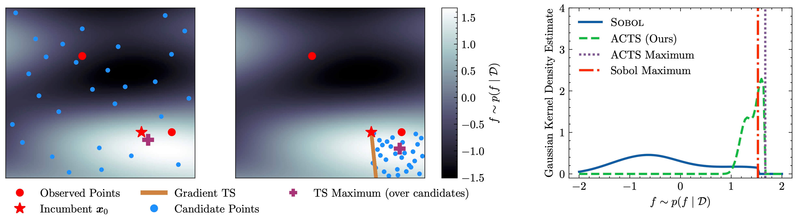

# Adaptive Candidate Thompson Sampling (ACTS)




An implementation of a Thompson Sampling strategy for high-dimensional Bayesian Optimization that leverages
gradient samples to guide search.
ACTS generates candidate points in subspaces guided by the gradient of a Gaussian Process posterior sample.
Compatible with trust region methods such as [TuRBO](https://arxiv.org/abs/1910.01739), ACTS produces better samples of maxima and improved optimization across synthetic and real-world benchmarks.
 
## Installation

```bash
git clone git@github.com:DonneyF/ACTS.git
cd ACTS
pip install -r requirements.txt
pre-commit install
```

**Benchmark dependencies**

To use the Guacmol/Molecule benchmark tasks you will need `rdkit>=2024.09.1`. On clusters with
the AllianceCan/ComputeCanada software stack, you can run `module load rdkit/2024.09.6` before loading
your virtual environment.

For MuJoCo benchmark tasks, an apptainer `sif` file needs to be provided to run MuJoCo objectives, which can be obtained from https://github.com/DonneyF/mujoco-v2-for-global-optimization.

**Weights and Biases**

This project uses [Weights and Biases](https://wandb.ai/) for logging and experiment tracking.
Logging can be disabled by passing `logging.wandb=null` as a command line argument.


## Running Experiments

This project uses [Hydra](https://hydra.cc/) to manage run configurations under the hood.
All configurable options are defined in `configs/default.yaml`, which contains
default values for every tunable option.
You can also override these options through the command line using Hydra's dot-list syntax:

```bash
# Example
python main.py benchmark=mopta08 seed=0 benchmark.n_tot=200 acquisition.q=1
```

## Running ACTS

An example command to run ACTS on the Rover Benchmark:
```
python main.py acquisition=acts gp=jacobianrbfgp trust_region=turbo benchmark=rover
```

You can optionally run ACTS within your own BO framework by transplanting the following pieces:
1. The Jacobian GP: `JacobianRBFGP` from `src/models/jacobian.py`
2. The ACTS acquisition routine: `AdaptiveCandidateThompsonSampling` from `src/acquisition/acts.py`
